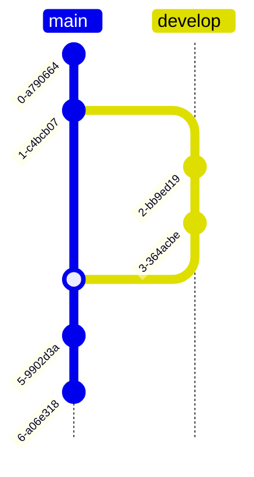

# Slidev Theme FoamScience

A Catppuccin-themed presentation template for academic/technical topics


Avenue, Occasion, Date


---
hideInToc: true
---

# Table of Content

<Toc :columns="2" :mode="onlyCurrentTree" />

---

# Features

This theme includes:

- **Catppuccin Colors** - Beautiful pastel theme with light (Latte) and dark (Mocha) variants
- **D3.js Integration** - Animated and themed charts with automatic color matching
- **Plotly.js Integration** - In case your charts come from Python
- **Citations** - BibTeX support with automatic reference management
- **PrimeVue components** - Fast, modern and lightweight Vue 3 components

<br>

All components automatically adapt to light/dark mode!

---

# D3.js integration

<br/>

- 🎨 **D3.js charts** - feel at home with integrated theming both in light/dark modes
- 📚 **Data** - can also be supplied with JSON file, unlocking external tool usage
- 📊 **Incremental** - The input data can be structured for incremental rendering
- **Flexible** - Toggle what legend item is shown by clicking on it!

Extensive support for D3.js components

---
layout: two-cols-header
---

## Basic charts

<br/>

::right::

- Supplying a `const salesData` in a `<script setup>` for a bar chart:

<script setup>
const salesData = {
  labels: ['Q1', 'Q2', 'Q3', 'Q4'],
  datasets: [{
    label: 'Sales 2023',
    data: [45, 59, 80, 81]
  }, {
    label: 'Sales 2024',
    data: [55, 72, 88, 95]
  }]
}
</script>

<Chart type="bar" :data="salesData" :height="350" legendPosition="bottom-right" />

::left::

- Load data from external JSON files (e.g., generated by Python scripts)

<Chart type="line" data="/chart-data.json" :height="350"  legendPosition="top-left" />

---

## Animated Chart

<script setup>
const scatterStates = [
  { label: 'Initial Clusters', data: '/scatter-state1.json' },
  { label: 'Clusters Moving', data: '/scatter-state2.json' },
  { label: 'Clusters Merged', data: '/scatter-state3.json' }
]
</script>

Watch how data points move between states!

<AnimatedChart
  :states="scatterStates"
  type="scatter"
  :height="320"
  :transitionDuration="1200"
/>

Use arrow keys or click the controls to navigate between states.

---

## External-language Integration Example

Generate JSON data files with Python:

```python
import json
import numpy as np
np.random.seed(42)
cluster1 = np.random.randn(20, 2) + [2, 3]
cluster2 = np.random.randn(20, 2) + [7, 5]
data = {
    "datasets": [
        { "label": "Cluster A", "data": [{"x": float(x), "y": float(y)} for x, y in cluster1] },
        { "label": "Cluster B", "data": [{"x": float(x), "y": float(y)} for x, y in cluster2] }
    ]
}
with open('public/scatter-data.json', 'w') as f:
    json.dump(data, f, indent=2)
```

Then use in slides: `<Chart data="/scatter-data.json" type="scatter" />`

---
zoom: 0.6
layout: two-cols-header
---

# Supported Chart Types

<script setup>
const pieData = {
  labels: ['Vue', 'React', 'Angular', 'Svelte'],
  datasets: [{
    data: [40, 30, 20, 10]
  }]
}

const radarData = {
  labels: ['Speed', 'Reliability', 'Features', 'Documentation', 'Community'],
  datasets: [{
    label: 'Framework A',
    data: [90, 85, 80, 95, 88]
  }, {
    label: 'Framework B',
    data: [75, 90, 95, 80, 85]
  }]
}
</script>

<br/>

::right::

Violin plots
<Chart data="/violin-demo.json" :height="350" legendPosition="top-right" />

Error bars
<Chart data="/errorbar-demo.json" :height="350" legendPosition="top-left" />

::left::

Radar charts
<Chart type="radar" :data="radarData" :height="250" />

Histograms
<Chart data="/histogram-demo.json" :height="350" legendPosition="top-right" />

---
zoom: 0.55
layout: two-cols-header
hideInToc: true
---

# Supported Chart Types

<br>

::right::

Box plot
<Chart data="/boxplot-demo.json" :height="350" legendPosition="top-right" />

Stacked area plots
<Chart data="/stackedarea-demo.json" :height="350" legendPosition="top-right" />

::left::

Heatmap
<Chart data="/heatmap-demo.json" :height="350" legendPosition="none" />

Bubble chart
<Chart data="/bubble-demo.json" :height="350" legendPosition="top-right" />

---
zoom: 0.55
layout: two-cols-header
hideInToc: true
---

# Supported Chart Types

<br/>

::right::

Vertical bar charts
<Chart data="/bar-chart-demo.json" :height="300" legendPosition="outside-top" />


::left::

<script setup>
const horizontalBarData = {
  labels: [0, 1, 2, 3, 4],
  components: [{
    id: 'h-bars',
    type: 'bar',
    label: 'Performance',
    data: [65, 59, 90, 81, 56],
    color: '#a6e3a1',
    orientation: 'horizontal',
    lifetimeStart: 0
  }],
  currentState: 0,
  xRange: [0, 100],
  yRange: [0, 4],
  xAxisLabel: 'Score',
  yAxisLabel: 'Test ID'
}
</script>

Horizontal bar plots
<Chart :data="horizontalBarData" :height="300" legendPosition="outside-top" />

---
zoom: 0.75
layout: two-cols-header
hideInToc: true
---


# Supported Chart Types

<br/>

The legend position is fairly customizable (although not Tikz-level)

::right::

<script setup>
const outsideTopData = {
  labels: [0, 10, 20, 30, 40],
  components: [
    {
      id: 'series-1',
      type: 'line',
      label: 'Dataset A',
      data: [10, 25, 15, 30, 20],
      color: '#89b4fa',
      strokeWidth: 2,
      lifetimeStart: 0
    },
    {
      id: 'series-2',
      type: 'line',
      label: 'Dataset B',
      data: [15, 20, 25, 20, 35],
      color: '#a6e3a1',
      strokeWidth: 2,
      lifetimeStart: 0
    }
  ],
  currentState: 0,
  xRange: [0, 40],
  yRange: [0, 40],
  xAxisLabel: 'Time',
  yAxisLabel: 'Value'
}
</script>

<Chart :data="outsideTopData" :height="250" legendPosition="outside-top" />

<Chart :data="outsideTopData" :height="250" legendPosition="outside-left" />

::left::

<Chart :data="outsideTopData" :height="250" legendPosition="outside-right" />

<Chart :data="outsideTopData" :height="250" legendPosition="outside-bottom-left" />


---

# Plotly Charts

Interactive Plotly.js charts with automatic Catppuccin theming.

Export Plotly figures from Python as JSON and display them with full interactivity.

<PlotlyChart data="/example-plotly-scatter.json" :height="340"
    :layout="{xaxis: { showgrid: false, zeroline: false }, yaxis: { showgrid: false, zeroline: false }}" />
/>

---
transition: fade
---

# Citations and References

<script setup>
import { onMounted } from 'vue'
import { useBibliography } from './composables/useBibliography'

const { loadJsonFromUrl } = useBibliography()

onMounted(async () => {
  await loadJsonFromUrl('/references.json')
})
</script>

From a `bib` file, generate a JSON equivalent:
```shell [Convert .bib to .json]
bibtojson -i references.bib -o public/references.json
```


Academic research shows that special relativity changed physics <Citation id="einstein1905" showAsFootnote="true" />, while the foundations of computer science were laid by pioneers like Turing <Citation id="turing1950" showAsFootnote="true" /> and Shannon <Citation id="shannon1948" showAsFootnote="true" />.

Modern programming practices <Citation id="knuth1984" showAsFootnote="true" /> build on structured approaches <Citation id="dijkstra1976"  showAsFootnote="true"/>, and machine learning relies on support vector networks <Citation id="vapnik1995" showAsFootnote="true" />.

- **Numeric (default)**: <Citation id="einstein1905" showAsFootnote="true" /> or **Parentheses**: <Citation id="turing1950" format="parentheses" showAsFootnote="true" />
- **Author-year**: <Citation id="einstein1905" citationStyle="author-year" showAsFootnote="true" />
- **Superscript**: <Citation id="shannon1948" format="superscript" showAsFootnote="true" />

---
hideInToc: true
---

# Citations and References

Display all cited references automatically (the `references.json` file needs to be in `/public` folder):

<References bibFile="/references.json" />

---
layout: two-cols-header
---

# Mermaid styling

Refresh the page to switch between dark/light themes!

::left::

<div class="flex justify-center">


</div>

::right::

<div class="flex justify-center">



</div>

---

# Math equations

Katex typesets inline $\text{\LaTeX}$ as follows $\sqrt{3x-1}+(1+x)^2$

and block equations:

$$ {1|3|all}
\begin{aligned}
\nabla \cdot \vec{E} &= \frac{\rho}{\varepsilon_0} \\
\nabla \cdot \vec{B} &= 0 \\
\nabla \times \vec{E} &= -\frac{\partial\vec{B}}{\partial t} \\
\nabla \times \vec{B} &= \mu_0\vec{J} + \mu_0\varepsilon_0\frac{\partial\vec{E}}{\partial t}
\end{aligned}
$$

---
src: primevue-components.md
---

---
src: custom-list-examples.md
---

---
src: chat-bubble-examples.md
---

---
layout: center
class: "text-center"
---

<span class="text-6xl">Thank You!</span>

[Documentation](./docs/components.md) · [GitHub](https://github.com/FoamScience/slidev-theme-foamscience)
